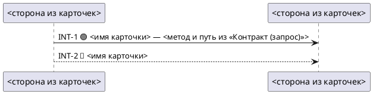

# План `technical-spec-doc` 1.1.0 → 1.2.0: схема взаимодействий (PlantUML) как проекция §2

> Повод — запись CHANGELOG 5.20 «Дальше: диаграмма PlantUML на интеграции (§2, проекция §1.2 и §2)»
> и п.1 §6 `PLAN-SPEC-COMB.md`. Заказ: «диаграмма последовательности при наличии взаимодействий —
> дорабатываемые сервисы, вызываемые методы, существующие / новые / изменяемые потоки».
> Три независимых консультанта 2026-09-24 сошлись в одном решении; план — их сведение плюс
> решения по развилкам. **v2 после двух ревью (оба «исполнять с правками»), см. §8.**
>
> **Состояние: ВЫПОЛНЕН 2026-09-24** по рекомендациям §7 (Р1, Р8, Р4, эмодзи остаётся, Р9). Исполнено T2, T4, T5, T6,
> T6a, T7, T8, T9 и §4 (чек-лист п.1/п.13, stage-breakdown Step 0); T3 снято ревью. Пилот поправил плейсхолдер
> участника («дословно из «Граница/направление», не переводить»). Замер: регресс D1 против базы 1.1.0 зелёный по
> пяти старым пробам (`bf-spec`, `ts-conv2` на N=20) и новой `ts-diag`; блок при карточках 32/32 записанных спек.
> Круг 2 (три строки ужесточения формы стрелки в цитате скелета) — красный по антивыдумке на `ts-conv`/`ts-ctx`,
> откачен; финальный текст = D1 = снимок `runs/2026-09-24-diag-d-v2/_skills/`. Отступления от плана: критерий Д7
> перезаписан по факту («схема не добавляет путь, которого нет в карточке» — 0 везде; зеркала карточек — дефект
> карточки, гипотеза в DEFECTS); Д8 грейдера исключает `<-`. Журнал и числа — `runs/2026-09-24-diag-criteria.md`,
> запись в CHANGELOG — 5.21.
>
> Здесь TS = `technical-spec-doc/SKILL.md` (1.1.0, 852 строки); номера строк — по нему на 2026-09-24.

## 0. Уроки, которые план обязан соблюсти

1. **Один файл на выходе** (TS:186, Self-Review п.7 TS:564–565; `grade-ts.mjs:340–343` красит
   лишний файл в корне). → Схема — fenced-блок ```` ```plantuml ```` внутри
   `technical_specification.md`. Никакого `.puml`, никакого второго скилла-писателя
   (`spec-review/SKILL.md:187–189`: второй писатель на файл запрещён).
2. **Форма не уезжает в `reference/`** (память 2026-08-06, 2026-09-22). → Скелет блока стоит в
   шаблоне `SKILL.md`.
3. **Легенда, шапка, двухпроходный Step 4, двойной маркер INT — измеренные рычаги**
   (PLAN-SPEC-COMB §0 п.5, 6, 9; CHANGELOG 5.20). → Новых маркеров нет; п.1–4 Step 4 (TS:508–516)
   не правятся; в заголовке карточки 🟢 остаётся первым токеном после «—».
4. **Антивыдумка держится счётом, а не суждением** (статус N, инвентарь стыков). → Каждое правило
   схемы — равенство множеств или запрет подстроки.
5. **Пример в шаблоне копируют** (`card.template.md:296–298` «совпал образец — не выводил»). →
   В шаблоне скелет с плейсхолдерами `<…>`, не заполненный пример; плейсхолдер в спеке = красный (Д8).
6. **Правка — размером с изменение поведения; обоснования — в CHANGELOG.** → У каждой правки
   1–3 строки в скилле.
7. **Хвост скилла на слабой модели теряется** (`DEFECTS.md`: `ts-conv-2t` спека на 2-м ходе
   0–2/20). → Схема не добавляет ни хода, ни вопроса, ни второго Edit: пишется в том же Write, что
   карточки, проверяется тем же Self-Review.
8. **Статус N считается по тексту файла** (TS:510–513 «собери каждый 🟡»). → На стрелках нет слов
   «к валидации» / «подтверждено аналитиком», только эмодзи и имя; п.12 говорит прямо: стрелки в
   «Открытые вопросы» не собираются.
9. **Сравнивать только внутри одной обёртки** (`run-ctx-v2.sh`), N=10 на плечо парно с базой,
   объём пула — решение человека.

## 1. Решения

| # | Вопрос | Решение | Почему |
|---|---|---|---|
| Р1 | Где живёт | внутри TS, §2, подраздел `### Схема взаимодействий (проекция карточек)` **после последней INT-карточки, перед «Каталогом ошибок»** | порядок записи слабой модели: карточки → проекция → каталог (обе производные от карточек); TS:740 правится |
| Р2 | Источник | **только карточки §2 этой же спеки**. `services/`, `context/`, §1.2, память о выжимке — не источник | единственный поток с гейтом происхождения — карточки; проекция наследует гейт бесплатно |
| Р3 | Участники | стороны, названные в поле «Граница/направление» карточек, дословно; объединение в порядке первого появления. Ни БД, ни кэша, ни брокера, ни строк §1.2 без карточки | считаемо по одним карточкам; нет висячих участников и исключения «Фронт». Чтобы стороны носили имена сервисов, TS:720 получает подсказку «по именам из §1.2» |
| Р4 | Стрелки | ровно одна стрелка на INT-карточку, направление из «Граница/направление», порядок = номера INT. **Ответных стрелок нет** | «стрелок = карточек» точное равенство; у события/async нет выдуманного «ответа»; поля ответа лежат в карточке |
| Р5 | Подпись | `INT-N <эмодзи> <имя карточки из заголовка>`; **только у 🟢** дальше ` — ` + метод и путь / имя события из поля «Контракт (запрос)» дословно. У 🔵, 🟡 и `🔵 depends-on #0` — только имя, даже если в карточке путь написан аналитиком (он остаётся в карточке). Без слов «к валидации» / «подтверждено аналитиком» | один инвариант «путь на стрелке только у 🟢»; запрет чужих путей (TS:168–175, 259–262, 545–547) исполняется сам; N не задваивается (урок 8) |
| Р6 | Стиль | 🟢 — сплошная `->`; 🔵/🟡/depends-on — пунктир `-->`. Эмодзи в подписи остаётся | два сигнала: человек без рендера видит эмодзи, рендер без шрифта — стиль; грейдер Д7 ключуется по обоим |
| Р7 | Грамматика | три конструкции: `@startuml/@enduml`, `participant "<имя>" as S<n>`, `A -> B : …` / `A --> B : …`. Запрещены `alt`, `loop`, `activate`, `note`, `box`, `skinparam`. Алиасы латиницей | кириллица в алиасе ломает рендер; ветвления — пища для выдумки, ошибки живут в каталоге |
| Р8 | Триггер | правило про **блок**, не про подраздел: §2 содержит ≥1 INT-карточку → блок обязателен; карточек нет (§2 «не применимо» / «взаимодействий нет») → блока нет, заголовок подраздела со строкой «не применимо: взаимодействий нет» допустим | не конфликтует с TS:668–669 «каждая секция присутствует», `bugfix-mode.md:53` «секция закрывается строкой», п.11 приёмки; вопроса аналитику не задаётся |
| Р9 | «Существующие / новые / изменяемые» | новое = 🟢; существующее, которое задача вызывает = 🔵/🟡; изменение **своего** существующего контракта = `🟢 (изменение)` словом в заголовке карточки после маркера | новых маркеров нет; схема копирует заголовок и покажет слово сама; прецедент формы — `foundation-node.md:35` «🟢 (фундамент, наследуется детьми)» |
| Р10 | Нетронутые существующие потоки | **не рисуются**. Их нет в спеке по построению (TS:712–713); переносить из карточек нельзя (TS:259, 297–299); ландшафт — территория `service-map` | иначе схема — второй источник фактов |
| Р11 | Когда пишется | в том же Write Step 4 п.1, место задаёт шаблон; без заглушки, без второго Edit, без правки п.1–4 | урок 3 и 7; расхождение ловит Self-Review п.12 |
| Р12 | Доработка | **любая правка карточки** (состав §2, флип 🟡→🔵, путь) → блок перепроецируется целиком | иначе после флипа маркера в схеме остаётся устаревший 🟡; аналог `service-map` «пересобери целиком» |

**Что заказчику сказать прямо:** «вызываемые методы» появятся на стрелках только у 🟢. Существующие
вызовы (🔵/🟡) на схеме названы словами; путь, который аналитик написал сам для 🔵, остаётся в тексте
карточки и на стрелку не копируется. Иное противоречит TS:168–175 и компромиссу D1 раунда ts-comb.

## 2. Правки — `technical-spec-doc/SKILL.md` (+≈20 строк)

| # | Где (строка 1.1.0) | Правка |
|---|---|---|
| T1 | TL;DR п.5 (TS:30–33) | без правки: «Заполни КАЖДУЮ секцию» уже покрывает подраздел |
| T2 | Step 4, абзац «Пиши лаконично… пересказ §2 в §3 → ставь ссылку» (TS:490–494) | +1 строка: «Схема в §2 — разрешённая проекция карточек, не пересказ: подпись стрелки = заголовок карточки; у 🟢 ещё поле «Контракт (запрос)» дословно, у 🔵/🟡 — только имя.» |
| ~~T3~~ | ~~Step 4 п.1~~ | **снято** (ревью 1): п.1–4 — измеренная связка заглушки; место блока задаёт шаблон |
| T4 | Step 5 Self-Review, после п.11 (TS:580–585) | +п.12 (3 строки): «**Схема = проекция.** Карточки есть → блок есть; стрелок ровно столько, сколько `### INT-`, и это те же номера; маркер на стрелке = маркер в заголовке; участник назван в поле «Граница/направление» хоть одной карточки; на `-->`-стрелках нет метода и пути; плейсхолдеров `<…>` нет. Стрелки в «Открытые вопросы» не собираются. Блок проверь тем же сканом, что п.1.» |
| T5 | Refinement, буллет «After editing — re-run Step 3.5, Step 5…» (TS:624) | +1 строка: «Тронул хоть одну карточку §2 (состав, маркер, путь) → блок схемы перепроецируй целиком, стрелки по одной не правь.» |
| T6 | Шаблон, заголовок INT-карточки (TS:719) и строка «Происхождение» (TS:735) | `— [🟢 / 🟢 (изменение — только своего контракта) / 🔵 / 🟡]`; 🟢 остаётся первым токеном |
| T6a | Шаблон, «Граница/направление» (TS:720) | `[<сторона> → <сторона> по именам из §1.2 \| событие: <издатель> → <потребитель>]` — даёт направление событию и имена участникам |
| T7 | Шаблон, между `### INT-2. …` (TS:738) и «Каталог ошибок» (TS:740) | +скелет подраздела, §3 ниже (≈12 строк). **Без внешней обёртки ````markdown** — шаблон уже в ней (TS:676), внутренний ```` ```plantuml ```` допустим как ```` ```json ```` на TS:725 |
| T8 | Шаблон, TS:740 | «последний подраздел §2, после всех INT-карточек» → «после всех INT-карточек и схемы» |
| T9 | Шапка | `version: 1.2.0` (minor: новая секция, форма артефакта совместима) |

Не трогаются: легенда TS:685–692, шапка шаблона TS:680–697, Step 4 п.1–4 TS:508–516, политика 🔵 и
антивыдумка TS:122–186, 259–299, 545–547, TL;DR TS:11–36.

## 3. Скелет подраздела (текст в шаблон, T7; обёртка ниже — только для этого плана)

````markdown
### Схема взаимодействий (проекция карточек)
> Только из карточек выше; вопросов аналитику не порождает. Участник = сторона из «Граница/направление».
> Одна стрелка на карточку, подпись = её заголовок (номер, эмодзи, имя — без слов «к валидации»);
> только у 🟢 дальше « — » и поле «Контракт (запрос)» дословно. Ответных стрелок нет. 🟢 — `->`,
> 🔵/🟡 — `-->`. Ничего кроме `participant` и стрелок; `alt`/`loop`/`activate`/`note` не пиши.
> Карточек нет — блока нет.

````

## 4. Правки соседям

| Файл | Строки | Правка | Версия |
|---|---|---|---|
| `spec-review/reference/checklist-spec.md` | п.1 (:23–41, цитирует TS:168–175) и счётная строка :219 | +1 строка: «`### Схема взаимодействий` — отдельный подраздел, не хвост последней карточки; в блоке `plantuml` считаются только строки, несущие 🟡» — иначе 🟢-путь в блоке красится как путь последней 🟡-карточки (ложный красный на `ts-conv`, `RV-DIRTY:62`) | 1.0.2 → 1.1.0 |
| то же | п.11 (:172–176) | **не трогать** список секций: фикстуры `RV-*` без блока дали бы ложный красный | — |
| то же | после п.12 (:184–213) | +п.13 «Схема расходится с карточками» — **«блока нет → пункт не применим, так и напиши»** первой строкой; нарушение: множество `INT-N` в блоке ≠ множеству `### INT-`; участник не назван ни в одной «Граница/направление»; метод+`/` на `-->`-стрелке или на строке с 🔵/🟡. Отсутствие блока при карточках ловит Self-Review спеки, не приёмка (v1) | в том же бампе |
| `stage-breakdown-doc/SKILL.md` | Step 0 извлечение (:113–119) | +1 строка: «Блок `plantuml` в §2 — проекция карточек: в извлечение и в файлы этапов не идёт, стыки считаются по `### INT-`». Блок — отдельный `###`, в `stage-NN.md` (:496–498 «карточка целиком») не уедет; `grade-rv-truth.mjs:32–35` режет карточки до следующего заголовка — блок вне карточек | patch |
| `spec-readiness/*` | — | без правок: перепись по номерам `INT-N` (`SKILL.md:149–152`, `reference/probe-contract.md:154–156`) | — |
| `technical-spec-doc/reference/bugfix-mode.md`, `small-change-mode.md` | :61–65, :157–168 | без правок: §2 «не применимо» → блока нет (Р8) | — |
| `technical-spec-doc/reference/foundation-node.md` | :35, :88–93 | без правок: карточка `🔵 depends-on #0` законно несёт путь в тексте; на стрелке — `-->` и имя (Р5); контракт в режиме B «можно переформатировать» → если `### INT-` у него нет, п.12 и Д3 считают только карточки с заголовком | — |
| `analyst-workspace`, `service-map` | — | без правок | — |

## 5. Стенд

**Грейдер `grade-ts.mjs`** — новые якоря, все `info: true` (конвенция :141–146: якорь моложе базы
в «зелёный целиком» не входит):
- Д1 блок ```` ```plantuml ```` есть ⇔ `### INT-` ≥ 1;
- Д2 `@startuml` … `@enduml`, ≥1 стрелка;
- Д3 **множество** `INT-\d+` в блоке == множество из заголовков `### INT-` (набор, не счёт: модель дублирует номер);
- Д4 каждая строка-стрелка матчит `^\w+\s*-{1,2}>\s*\w+\s*:\s*INT-\d+\s`;
- Д5 каждый `participant "…"` — подстрока поля «Граница/направление» хоть одной карточки (парсер: строки `- **Граница/направление:**`, разбор по `→`; парсера §1.2 в коде нет и не нужен);
- Д6 в блоке нет `alt|loop|activate|note|box|skinparam`;
- Д7 на строке, которая `-->`-стрелка **или** содержит 🔵/🟡, нет `(GET|POST|PUT|PATCH|DELETE) /`;
- Д8 в блоке нет `<` и `>` вне `->`/`-->` (плейсхолдер скелета не заменён; п.5 приёмки ищет только верхний регистр в шапке, `<имя карточки>` не поймает);
- существующий якорь «чужой эндпоинт не выписан» (:187–191) уже ищет по всему телу — блок покрыт;
  `ownDesign` (:232) получит лёгкий крен в зелёное от строк блока — не ложный, отметить в CHANGELOG.
Самопроверка `--selftest` (:367–398) на рукописной паре зелёный/красный до первого прогона (INDEX.md:178–181).
Проверено ревью 2: `(изменение)` после 🟢 (T6) не ломает `grade-ts:232`, `grade-ctx:114–123`,
`grade-invent:54,86`, `grade-rv-truth:35`, чек-лист п.2 — хвост после маркера никто не парсит.

**Пробы** (только `run-ctx-v2.sh`, парно с базой 1.1.0):

| Проба | Что сторожит для схемы |
|---|---|
| `ts-conv` | 2 карточки (🟢 FE→BE, 🟡 BE→auth): блок есть, на 🟡-стрелке нет пути — главная ловушка; ложный красный п.1 приёмки при старом тексте чек-листа |
| `ts-ctx` | выжимка с путями рядом: путь из карточки не уехал в подпись |
| `ts-conv2` | 🟢-тяжёлая: порядок и полнота стрелок |
| `ts-live` | регресс-страж: секции, статус, побег |
| `bf-spec` | §2 «не применимо» → блока нет, лишних файлов нет |
| `ts-conv-2t` | хвост записи на 2-м ходе не просел (по желанию, дороже) |

**Порядок:** пилот 1×`ts-conv` на правленом скилле → показать блок человеку → согласовать пул.
Ориентир: 5 проб × 10 × 2 плеча = 100 прогонов ≈ $16 на Haiku; `ts-conv-2t` +20 двухходовых ≈ +$5.
База 1.1.0 по `ts-conv`/`ts-live`/`ts-ctx` на v2 уже снята в раунде ts-comb — переснимать только
если менялся раннер. **Объём пула — решение человека.**

**Критерий зелёного:** по старым якорям не хуже базы (чужой путь, статус N, секции, побег); Д1–Д8
информационно, с числами в CHANGELOG. Красный на антивыдумке (`ts-ctx` утечка выше базы, или N
завышен из-за строк блока) → откат T7-скелета до варианта без ` — <метод и путь…>` в строке 🟢.

## 6. Что в этот раунд НЕ входит

- Нетронутые существующие потоки и «ландшафт» вызовов — артефакт `service-map`, не спеки (Р10).
- Отдельный скилл-проектор с чистым контекстом — эскалация, если счётчик утечки пути вырастет.
- Флаг отключения схемы на уровне проводника — заводить по запросу с поля, не заранее.
- Ответные стрелки, `alt` на ошибки, цвета `-[#green]>` — v2 после подтверждения рендерера.
- Правка списка секций в п.11 приёмки и досев блока в фикстуры `RV-*` — следующий раунд приёмки.

## 7. Открытые вопросы человеку

1. Место в §2 — после карточек, перед каталогом (Р1)? Альтернативы: перед INT-1 / после каталога.
2. Порог — ≥1 карточка (Р8)? Альтернатива: только сервис↔сервис / ≥3 участников.
3. Без ответных стрелок (Р4)? Альтернатива: голое «ответ» или поля у 🟢.
4. Где рендерится спека (Confluence / GitLab / IDE)? Решает, остаётся ли эмодзи в подписях.
5. `🟢 (изменение — только своего контракта)` как единственное различение «изменяемого» (Р9)?

## 8. Валидация плана v1 → v2 (2026-09-24)

- **Ревьюер 1 (целостность скилла): «исполнять с правками», 8 пунктов — все внесены.** T2 «у 🟢»;
  T3 снят; Р8 про блок, не подраздел; п.12 «маркер = заголовок, стрелки в N не идут»; T5 → TS:624
  «любая правка»; Р3 участники из границ карточек + T6a форма события; Р4 без ответных стрелок;
  T6 «только своего контракта» + depends-on #0.
- **Ревьюер 2 (корректность правок): «исполнять с правками», 5 пунктов — все внесены.** Снято
  противоречие «путь у 🔵» (Р5: только у 🟢); подпись без слов «к валидации»; чек-лист п.1/п.13
  «отдельный подраздел, не хвост карточки» и «блока нет → не применим»; Д8 и парсер Д5; якоря
  Р10 TS:297–299, §4 TS:168–175, grade-ts :340–343, TS:122–186.
- Совпавшие находки обоих: задвоение N от маркеров на стрелках; исключение «Фронт»; depends-on #0.
