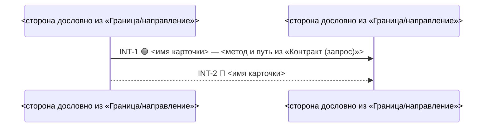
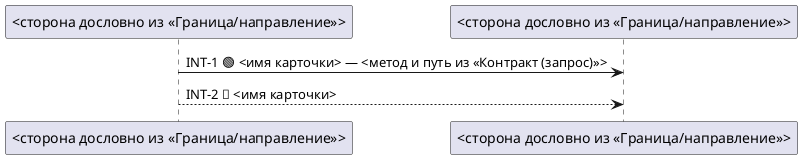

# Схема взаимодействий: проекция INT-карточек спеки

Ты не проектируешь и не уточняешь — ты перерисовываешь §2 спеки в картинку. Всё, что есть на
схеме, должно находиться в карточке `### INT-N` той же спеки. Стрелка, которой нет в карточках, или
путь, которого карточка не даёт для стрелки, — выдумка, и читатель схемы проверить её не может.

## TL;DR — пять правил, держи в голове всегда

1. **Вход — только `technical_specification.md`.** Дали БТ, баг-репорт или идею — схемы нет: ответь
   «сначала спецификация (`technical-spec-doc`)» и закончи ход.
2. **Источник — только карточки `### INT-N` §2 этой спеки.** Ни `services/`, ни `context/`, ни §1.2,
   ни БТ, ни то, что ты знаешь о системе; §1.2 — только сверка имён для отчёта, на схему из неё
   ничего не идёт. Вопросов по содержанию не задаёшь — единственный вопрос
   аналитику: формат.
3. **Одна карточка — одна стрелка.** Ответных стрелок нет, служебных нет, `alt`/`loop`/`note` нет.
4. **Путь — только у 🟢.** У 🔵, 🟡, ❓ и `🔵 depends-on #0` на стрелке только имя карточки, даже
   если в самой карточке путь написан. Стрелка к чужому сервису — пунктир.
5. **Спеку не правишь.** Выход — один файл схемы рядом со спекой. Нашёл в карточке пробел —
   назови его в отчёте, не додумывай.

Если правило ниже противоречит этому списку — прав список.

## Step 0 — вход

- Дали путь к `technical_specification.md` или папку `docs/<KEY>/`, где она лежит → читай её.
- Спеки нет (только `business_requirements.md`, `bug_report.md`, `change_request.md`, текст в
  чате) → ответ «Схема рисуется по готовой спецификации. Сначала `technical-spec-doc`.» Файл не
  пишешь.
- Прочитай спеку целиком. Выпиши для себя все заголовки `### INT-N` §2 — это список стрелок.
  Карточек нет (§2 «не применимо» или «новых/изменённых взаимодействий нет») → ответ «В спеке нет
  INT-карточек — рисовать нечего.» Файл не пишешь.

## Step 1 — формат

Формат уже назван в запросе («в mermaid», «плантюмл») → не спрашивай. Иначе один вопрос
(`AskUserQuestion`):

| Вариант | Что получится |
|---|---|
| Mermaid | `interaction_diagram.md` с блоком `mermaid`: рисуется в GitHub, GitLab и JetBrains без установки, в VS Code — с расширением |
| PlantUML | `interaction_diagram.puml`: рисуется в IDE с плагином PlantUML; в GitHub виден как текст |

## Step 2 — проекция

Иди по карточкам в порядке номеров. Из каждой возьми три поля.

| Что на схеме | Откуда | Правило |
|---|---|---|
| участники | «Граница/направление» | стороны слева и справа от `→` — любые, в том числе устройство или человек; дословно, буква в букву: не переводи, не сокращай, регистр не меняй; без обратных кавычек и без пояснения в скобках о способе вызова («(синхронно)», «(через Kafka)»); порядок — первого появления; одинаковое имя — один участник, разное — разные, даже если похоже на один сервис (не склеивай, не пропускай; такое имя уйдёт в отчёт) |
| стрелка | «Граница/направление» | от левой стороны к правой; у события — от издателя к потребителю |
| подпись | заголовок карточки | `INT-N <эмодзи> <имя карточки>`; слов «к валидации», «подтверждено аналитиком» нет |
| хвост подписи | «Контракт (запрос)» | **только у 🟢**: ` — ` и метод с путём или имя события дословно; у остальных хвоста нет |
| вид стрелки | маркер в заголовке | 🟢 — сплошная; 🔵, 🟡, ❓, `🔵 depends-on #0` — пунктир |

Направление в карточке не указано или стрелку `→` не из чего собрать → стрелку этой карточки не
рисуешь и называешь её в отчёте. Не угадывай сторону по имени карточки. Других причин пропустить
стрелку нет.

## Step 3 — запись

Файл — рядом со спекой, в той же папке. Есть старый файл того же формата — перепиши целиком, по
одной стрелке не правь. Есть файл другого формата — не трогай и назови его в отчёте: две схемы
одной спеки разъезжаются при первой правке карточек.

**Mermaid → `interaction_diagram.md`:**

````markdown
# Схема взаимодействий — <KEY>

> Проекция §2 `technical_specification.md`, по стрелке на INT-карточку. Руками не править:
> изменились карточки — перерисуй скиллом `interaction-diagram`.
> Сплошная — новый контракт (🟢), пунктир — существующий или к валидации (🔵/🟡).


````

Mermaid ломается молча, поэтому два правила без исключений: алиас — только `S1`, `S2`… (дефис,
пробел или кириллица в алиасе, например `dispatch-web`, рвут схему; имя стороны идёт после `as`);
в подписи `;` замени на `#59;`, `#` — на `#35;`.

**PlantUML → `interaction_diagram.puml`:**



Скелет — форма, а не пример: `<…>` заменяются значениями из карточек, строк ровно столько,
сколько участников и карточек. В обоих форматах алиасы `S1`, `S2`… по порядку участников, имя
стороны — только в подписи участника. Кроме `participant` и стрелок ничего не пиши.

## Step 4 — самопроверка (перечитай записанный файл)

1. Номера `INT-N` на стрелках = номера `### INT-N` в спеке, минус названные в отчёте без
   направления. Ни одного лишнего, ни одного дубля.
2. Эмодзи и вид стрелки = маркер в заголовке её карточки: 🟢 — сплошная, остальное — пунктир.
3. У каждого участника алиас `S<n>`, а имя буква в букву совпадает со стороной в «Граница/направление»
   хоть одной карточки.
4. На пунктирной стрелке нет метода и пути (`GET`, `POST`, `PUT`, `PATCH`, `DELETE` рядом с `/`).
5. `<…>` из скелета не осталось.

Не сошлось — перепиши файл и проверь снова.

## Step 5 — отчёт

```
схема: docs/<KEY>/interaction_diagram.md (Mermaid)
стрелок: 4 из 4 карточек
без стрелки: —
нет в §1.2: —
другой формат рядом: —
```

«Без стрелки» — номера карточек, где направление не из чего взять, с причиной. «Нет в §1.2» —
участники, чьего имени нет в таблице §1.2 спеки, дословно; разбирается аналитик, в спеке. Рядом одна строка,
где схема рисуется для выбранного формата (из таблицы Step 1). Больше ничего: пересказ схемы
словами — то же, что вторая схема.

## Чего ты не делаешь никогда

- **Не правишь спеку.** Даже если карточка без направления и ответ очевиден. У спеки один автор —
  `technical-spec-doc`.
- **Не рисуешь нетронутые существующие потоки.** В спеке их нет по построению; ландшафт системы —
  это `service-map`.
- **Не переносишь путь 🔵/🟡 на стрелку.** Путь чужого сервиса на картинке читается как факт
  сильнее, чем в тексте карточки с меткой рядом.
- **Не пишешь схему внутрь спеки.** Схема — отдельный файл; спека остаётся одним файлом одного
  автора.
