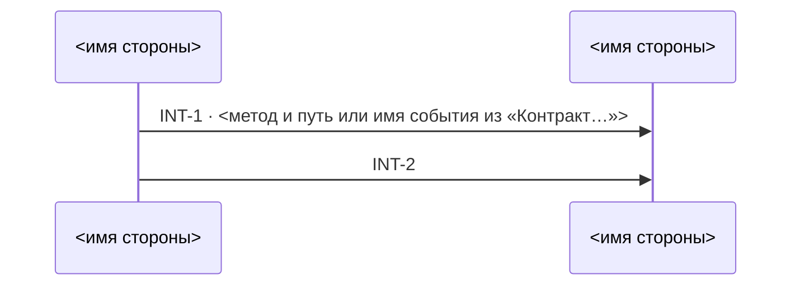
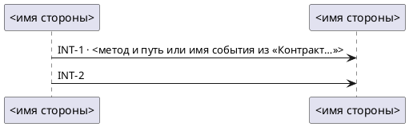

# Схема взаимодействий: проекция INT-карточек спеки

Ты не проектируешь и не уточняешь — ты перерисовываешь §2 спеки в картинку. Всё, что есть на
схеме, должно находиться в карточке `### INT-N` той же спеки. Стрелка, которой нет в карточках, или
путь, которого нет в карточке, — выдумка, и читатель схемы проверить её не может.

## TL;DR — четыре правила, держи в голове всегда

1. **Вход — только `technical_specification.md`.** Дали БТ, баг-репорт или идею — схемы нет: ответь
   «сначала спецификация (`technical-spec-doc`)» и закончи ход.
2. **Источник — только карточки `### INT-N` §2 этой спеки**, и в них — только номер,
   «Граница/направление» и «Контракт…» (запрос или событие); у подробной схемы — ещё «Триггер»,
   «Контракт (ответ)» и «Ошибки». Ни `services/`, ни `context/`, ни §1.2, ни БТ, ни то, что ты знаешь
   о системе; §1.2 — только сверка имён для отчёта. Вопросов по содержанию не задаёшь — аналитика
   спрашиваешь только о формате и типе схемы.
3. **Одно звено границы — одна стрелка.** `A → B` — одна, `A → B → C` — две, у обеих номер своей
   карточки. Служебных стрелок нет, `alt`/`loop` нет. В короткой схеме нет ответных стрелок и `note`;
   в подробной — только ответ, ошибки и пометка триггера своей карточки, по правилам Step 2.
4. **Спеку не правишь.** Выход — один файл схемы рядом со спекой. Нашёл в карточке пробел —
   назови его в отчёте, не додумывай.

Если правило ниже противоречит этому списку — прав список.

## Step 0 — вход

- Дали путь к `technical_specification.md` или папку `docs/<KEY>/`, где она лежит → читай её.
- Спеки нет (только `business_requirements.md`, `bug_report.md`, `change_request.md`, текст в
  чате) → ответ «Схема рисуется по готовой спецификации. Сначала `technical-spec-doc`.» Файл не
  пишешь.
- Прочитай спеку целиком. Выпиши для себя все заголовки `### INT-N` §2 — это список карточек.
  Карточек нет (§2 «не применимо» или «новых/изменённых взаимодействий нет») → ответ «В спеке нет
  INT-карточек — рисовать нечего.» Файл не пишешь.

## Step 1 — формат и тип

Формат уже назван в запросе («в mermaid», «плантюмл») → о формате не спрашивай. Тип назван
(«подробную», «с ответами и ошибками») → подробная. Назван только формат → короткая, о типе не
спрашивай. Не названо ничего → два вопроса одним вызовом (`AskUserQuestion`): формат и тип.

| Вариант | Что получится |
|---|---|
| Mermaid | `interaction_diagram.md` с блоком `mermaid`: рисуется в GitHub, GitLab и JetBrains без установки, в VS Code — с расширением |
| PlantUML | `interaction_diagram.puml`: рисуется в IDE с плагином PlantUML; в GitHub виден как текст |

| Тип | Что на схеме | Файл |
|---|---|---|
| Взаимодействия сервисов (короткая) | кто кого вызывает: стрелка на звено, номер, метод | `interaction_diagram.md` / `.puml` |
| Подробная | то же и на каждую карточку — что её запускает, ответ, ошибки | `interaction_diagram_detailed.md` / `.puml` |

## Step 2 — проекция

Иди по карточкам в порядке номеров. Из каждой возьми номер и два поля.

| Что на схеме | Откуда | Правило |
|---|---|---|
| участники | «Граница/направление» | стороны слева и справа от `→`, `←` или `↔`; префикс `событие:` и обратные кавычки сними; имя — текст стороны до первой ` (`, дальше не бери; остальное буква в букву: не переводи, не сокращай, регистр не меняй; порядок — первого появления; одинаковое имя — один участник, разное — разные, даже если похоже на один сервис (не склеивай; такое имя уйдёт в отчёт). `→` внутри пояснения в скобках сторон не даёт: в `A (x → y) → B` стороны — A и B; скобку и точку на конце имени сними |
| стрелка | «Граница/направление» | `A → B` — от A к B; `A ← B` — от B к A; `A ↔ B` — одна двусторонняя; граница начинается с `событие:` — асинхронная стрелка от издателя к потребителю. Цепочка `A → B → C` — стрелка на каждую пару соседних сторон, слева направо, каждая по своему знаку, у всех номер карточки. Синтаксис — в таблице ниже |
| подпись | номер карточки и «Контракт…» (запрос или событие) | `INT-N`; в контракте есть метод с путём (`POST /v1/returns`) или имя события — `INT-N · <метод и путь или имя события>`, только сам токен, без слов вокруг: из «предположительно `POST /x`» берёшь `POST /x`. В цепочке методы контракта раздавай звеньям по порядку: первый метод с путём — первому звену, второй — второму; звену, которому метода не хватило, — только `INT-N` |

| Граница | Mermaid | PlantUML |
|---|---|---|
| `A → B` | `S1->>S2: …` | `S1 -> S2 : …` |
| `A ← B` | `S2->>S1: …` | `S2 -> S1 : …` |
| `A ↔ B` | `S1<<->>S2: …` | `S1 <-> S2 : …` |
| `событие: A → B` | `S1-)S2: …` | `S1 ->> S2 : …` |
| `A → B → C` | `S1->>S2: …` и `S2->>S3: …` | `S1 -> S2 : …` и `S2 -> S3 : …` |

Направление в карточке не указано (нет ни `→`, ни `←`, ни `↔`) или не хватает стороны → стрелки этой
карточки не рисуешь и называешь её в отчёте. Не угадывай сторону по имени карточки. Других причин
пропустить стрелку нет — ни человек, устройство или браузер на стороне, ни отсутствие пути в
контракте, ни неподтверждённый или TBD контракт.

### Подробная схема

Стрелки-запросы — те же и по тем же правилам. На каждую карточку добавь к ним пометку, ответ и
ошибки; порядок строк карточки: пометка, запросы, ответ, ошибки.

| Что | Поле карточки | Правило | Mermaid | PlantUML |
|---|---|---|---|---|
| пометка | «Триггер» | над стороной, от которой идёт первый запрос карточки; `INT-N · ` и текст поля одной строкой, слово в слово; поля нет — пометки нет | `Note over S1: INT-N · …` | `note over S1 : INT-N · …` |
| ответ | «Контракт (ответ)» | одна пунктирная стрелка навстречу первому запросу карточки, подпись ровно `INT-N · ответ` | `S2-->>S1: INT-N · ответ` | `S2 --> S1 : INT-N · ответ` |
| ошибки | «Ошибки» | одна стрелка с крестом навстречу первому запросу карточки, в подписи все коды поля через запятую | `S2--xS1: INT-N · 404, 409` | `S2 -->x S1 : INT-N · 404, 409` |

Ответа нет, если поля «Контракт (ответ)» нет, граница — `событие:` или `↔`, либо значение поля
начинается с «нет», «не применимо», «❓», «TBD» или «🟡». Код — трёхзначное число на 4 или 5 (`404`,
`502`) либо `4xx`, `5xx`, записанное в поле «Ошибки» этой карточки; `200`, `204`, «3 попытки»,
«10 с» — не коды. Кодов в поле нет («см. каталог», текст без кодов, TBD) — стрелки ошибок нет; из
«Каталога ошибок» и из других карточек кодов не бери. У цепочки ответ и ошибки — одни на карточку,
между первой и второй стороной.

## Step 3 — запись

Файл — рядом со спекой, в той же папке. Есть старый файл того же типа и формата — перепиши целиком,
по одной стрелке не правь. Есть другие файлы схемы (другой формат или тип) — не трогай и назови их в
отчёте: схемы одной спеки разъезжаются при первой правке карточек.

**Mermaid → `interaction_diagram.md`:**

````markdown
# Схема взаимодействий — <KEY>

> Проекция §2 `technical_specification.md`, по стрелке на звено границы INT-карточки; порядок стрелок —
> порядок карточек, не время. Руками не править: изменились карточки — перерисуй скиллом `interaction-diagram`.


````

Mermaid ломается молча, поэтому два правила без исключений: алиас — только `S1`, `S2`… (дефис,
пробел или кириллица в алиасе, например `dispatch-web`, рвут схему; имя стороны идёт после `as`);
в подписи и в пометке `;` замени на `#59;`, `#` — на `#35;`.

**PlantUML → `interaction_diagram.puml`:**



Скелет — форма, а не пример: `<…>` заменяются значениями из карточек, строк ровно столько,
сколько участников и звеньев. В обоих форматах алиасы `S1`, `S2`… по порядку участников, имя
стороны — только в подписи участника. В короткой схеме кроме `participant` и стрелок ничего не пиши.

**Подробная → `interaction_diagram_detailed.md` / `interaction_diagram_detailed.puml`:** тот же скелет,
заголовок — «Подробная схема взаимодействий — <KEY>», строки карточки:

```
    Note over S1: INT-1 · <текст поля «Триггер»>
    S1->>S2: INT-1 · <метод и путь или имя события из «Контракт…»>
    S2-->>S1: INT-1 · ответ
    S2--xS1: INT-1 · <коды из «Ошибки» через запятую>
```

```
note over S1 : INT-1 · <текст поля «Триггер»>
S1 -> S2 : INT-1 · <метод и путь или имя события из «Контракт…»>
S2 --> S1 : INT-1 · ответ
S2 -->x S1 : INT-1 · <коды из «Ошибки» через запятую>
```

## Step 4 — самопроверка (перечитай записанный файл)

1. Номера `INT-N` на стрелках = номера `### INT-N` в спеке, минус названные в отчёте без
   направления. Стрелок с одним номером — столько, сколько звеньев в границе карточки; ни одной лишней.
2. Вид и направление каждой стрелки = строка таблицы Step 2 для её звена.
3. У каждого участника алиас `S<n>`, а имя = сторона хоть одной карточки до первой ` (`.
4. После `INT-N ·` — ровно токен метода с путём или имя события из «Контракт…» её карточки;
   карточке без метода и звену, которому метода не хватило, — подпись только `INT-N`.
5. `<…>` из скелета не осталось.
6. Подробная: пункты 1 и 4 считай по стрелкам-запросам. У каждой карточки с «Триггером» — одна
   пометка; ответ — один и только там, где он положен по Step 2; на стрелке ошибок — все коды поля
   «Ошибки» своей карточки и ни одного чужого.

Не сошлось — перепиши файл и проверь снова.

## Step 5 — отчёт

```
схема: docs/<KEY>/interaction_diagram.md (Mermaid)
карточек: 4 из 4, стрелок: 4
без стрелки: —
нет в §1.2: —
другие схемы рядом: —
```

«Без стрелки» — номера карточек, где направление не из чего взять, с причиной. «Нет в §1.2» —
участники-сервисы, чьего имени нет в таблице §1.2 спеки, дословно (люди и устройства не в счёт):
возможно, тот же сервис назван иначе — разбирается аналитик, в спеке. Рядом одна строка,
где схема рисуется для выбранного формата (из таблицы Step 1). У подробной «стрелок» — число
запросов, и следом строка «ответов: K, ошибок: M». Больше ничего: пересказ схемы
словами — то же, что вторая схема.

## Чего ты не делаешь никогда

- **Не правишь спеку.** Даже если карточка без направления и ответ очевиден. У спеки один автор —
  `technical-spec-doc`.
- **Не рисуешь нетронутые существующие потоки.** В спеке их нет по построению; ландшафт системы —
  это `service-map`.
- **Не пишешь схему внутрь спеки.** Схема — отдельный файл; спека остаётся одним файлом одного
  автора.
