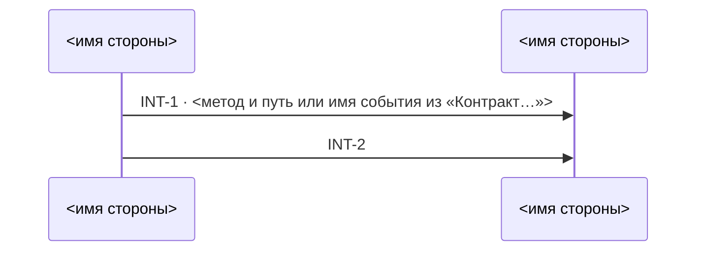
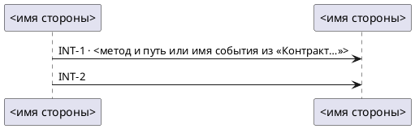

# Схема взаимодействий: форма файла

Что рисовать — участники, стрелки, подписи, порядок карточек — решено по `SKILL.md`. Здесь — как
это записать в файл и как проверить записанное.

## Стрелки

`S1` и `S2` в таблице — алиасы сторон A и B этой границы.

| Граница | Mermaid | PlantUML |
|---|---|---|
| `A → B` | `S1->>S2: …` | `S1 -> S2 : …` |
| `A ← B` | `S2->>S1: …` | `S2 -> S1 : …` |
| `A ↔ B` | `S1<<->>S2: …` | `S1 <-> S2 : …` |
| `событие: A → B` | `S1-)S2: …` | `S1 ->> S2 : …` |
| `A → B → C` | `S1->>S2: …` и `S2->>S3: …` | `S1 -> S2 : …` и `S2 -> S3 : …` |

## Mermaid → `interaction_diagram.md`

````markdown
# Схема взаимодействий — <KEY>

> Проекция INT-карточек `technical_specification.md`, по стрелке на звено границы; порядок стрелок —
> <порядок>. Руками не править: изменились карточки — перерисуй скиллом `interaction-diagram`.


````

Mermaid ломается молча, поэтому два правила без исключений: алиас — только `S1`, `S2`… (дефис,
пробел или кириллица в алиасе рвут схему; имя стороны идёт после `as`); в подписи `;` замени на
`#59;`, `#` — на `#35;`.

## PlantUML → `interaction_diagram.puml`



## Как заполнять скелет

Скелет — форма, а не пример: `<…>` заменяются значениями, строк ровно столько, сколько участников и
звеньев. Кроме шапки, `participant` и стрелок ничего не пиши.

- `<KEY>` — имя папки, в которой лежит спека.
- `<порядок>` — «по времени, со слов аналитика», если аналитик ответил на вопрос о порядке; иначе
  «по номерам карточек, не по времени».
- Алиасы `S1`, `S2`… — по порядку участников; имя стороны — только в строке `participant`.

## Самопроверка — перечитай записанный файл

1. Номера `INT-N` на стрелках = номера карточек спеки, минус карточки без стрелок. Стрелок с одним
   номером — столько, сколько звеньев у карточки; ни одной лишней.
2. Вид и направление каждой стрелки = строка таблицы «Стрелки» для её звена.
3. У каждого участника алиас `S<n>`; имя — сторона карточки до первой ` (`.
4. После `INT-N ·` — ровно токен метода с путём или имя события из «Контракт…» её карточки;
   карточке без метода и звену, которому метода не хватило, — подпись только `INT-N`.
5. Карточки идут в порядке из ответа аналитика, без ответа — по номерам; `<порядок>` в шапке
   говорит то же.
6. Где аналитик ответил, пункты 1–5 сверяй с его ответом, а не с карточкой; где не ответил — с
   таблицей «Вопрос без ответа» из `SKILL.md`.
7. `<…>` из скелета не осталось.
