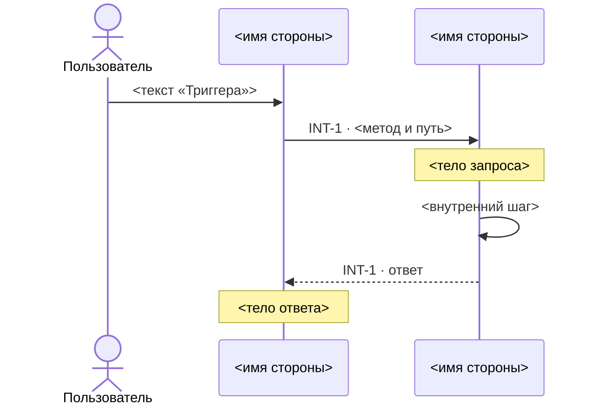
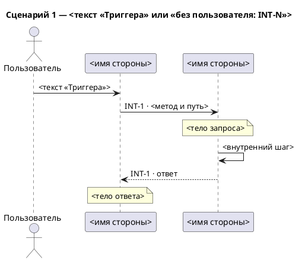

# Сценарная схема: что нарисовать и как записать

Сценарная схема — по диаграмме на сценарий: что происходит от действия пользователя до последнего
вызова, по времени, с ответами, телами запросов и внутренними шагами сервисов. В `SKILL.md` — вход,
тип, формат, чтение границы и контракта, список карточек с триггерами, все вопросы, в том числе о
сценариях и внутренних шагах, ответ аналитика, отчёт. Здесь — что рисовать в сценарии и как записать.

## Что ещё берёшь из карточки

| Поле | Зачем |
|---|---|
| «Триггер» | кто и что запускает карточку — из него собирается гипотеза сценариев |
| «Контракт (запрос)» или «Контракт (событие)» | тело запроса или события |
| «Контракт (ответ)» | тело ответа |

Тело — имена полей, которые перечисляет контракт: в фигурных скобках `{ … }` (скобки внутри пути,
`/items/{id}`, — не тело), списком после слова «тело» или подпунктами под полем контракта; из
списка и подпунктов берёшь только имя поля, без типа и пояснений; у события — список полей после его
имени. Метод и путь, имена сервисов, кто кого вызывает и прочий текст контракта — не тело. Тела
нет — пометки нет.

## Что рисуешь в сценарии

Участники сценария — стороны его карточек по порядку первого появления в нём; алиасы `S1`, `S2`…
заново в каждом сценарии.

- **Пользователь.** Сценарий начинает действие человека → первый участник `Пользователь` и стрелка от
  него к первой стороне первой карточки с текстом её «Триггера». Сценарий без пользователя
  начинается сразу с запроса.
- **Запросы** — по правилам `SKILL.md` Step 2: вид, направление, подпись `INT-N · <метод и путь>`.
- **Тело запроса или события** — сразу после стрелки пометка над её получателем с телом; у цепочки —
  только после первого запроса.
- **Порядок карточек.** Карточка, названная «внутри INT-N», идёт после запроса той карточки и до её
  ответа; у цепочки — после запроса того звена, получатель которого её вызывает; несколько вложенных
  в одну карточку — в названном порядке, каждая после ответа предыдущей. Остальные карточки сценария
  идут друг за другом, каждая — после ответа предыдущей.
- **Ответ** — на каждое звено `→` и `←` пунктирная стрелка обратно, подпись `INT-N · ответ`, после
  вызовов, вложенных в это звено. У события и `↔` ответа нет. У цепочки `A → B → C` порядок такой:
  запрос `A → B`, запрос `B → C`, ответ `C → B`, ответ `B → A`.
- **Тело ответа** — пометка над получателем ответа с телом из «Контракт (ответ)», только после ответа
  на первый запрос карточки.
- **Внутренний шаг** — стрелка сервиса на себя с текстом шага, там, где назвал аналитик.

Ответа пользователю и ошибок нет — их нет в карточках. Полос активности, `group`, `alt` и `loop` нет:
несбалансированный `activate` молча ломает Mermaid, а границ блоков карточки не задают.

## Файл

Один файл на все сценарии, рядом со спекой. Mermaid → `interaction_scenarios.md`, раздел и блок
`mermaid` на сценарий; PlantUML → `interaction_scenarios.puml`, блок `@startuml` … `@enduml` на
сценарий. Правила Mermaid из `reference/short.md` действуют и здесь: алиасы сторон — `S1`, `S2`…,
единственный другой алиас — `U` у пользователя; `;` и `#` заменяй в подписях, пометках и тексте
«Триггера».

````markdown
# Сценарии взаимодействий — <KEY>

> Проекция INT-карточек `technical_specification.md` <источник сценариев>. Руками не править:
> изменились карточки — перерисуй скиллом `interaction-diagram`.

## Сценарий 1 — <текст «Триггера» или «без пользователя: INT-N»>


````



Скелет — форма, а не пример: `<…>` заменяются значениями, строк ровно столько, сколько участников,
запросов, ответов, пометок и шагов. Кроме шапки, заголовков, `actor`, `participant`, стрелок и
пометок ничего не пиши. `<источник сценариев>` — «по сценариям со слов аналитика», если аналитик
ответил на вопрос о сценариях; иначе «по карточке на сценарий, сценарии не подтверждены».

## Самопроверка — перечитай записанный файл

1. Сценариев столько, сколько назвал аналитик, и ещё по одному на каждую карточку, которую он не
   назвал; без ответа — по карточке на сценарий. В каждом — его карточки в его порядке, вложенные —
   между запросом и ответом той, внутри которой идут.
2. Запросы и участники — по пп. 2–4 и 6 самопроверки `reference/short.md`; алиас `U` у пользователя
   — не нарушение п.3.
3. У каждого звена `→` и `←` — ответ пунктиром; у события и `↔` ответа нет.
4. Пометки — только с телом своей карточки.
5. Внутренние шаги — только названные аналитиком.
6. `<…>` из скелета не осталось.

## Отчёт

Строки те же, что в `SKILL.md` Step 5, кроме двух: вместо «стрелок» — «сценариев: N»; вместо
«порядок» — «сценарии: по сценариям со слов аналитика» или «сценарии: по карточке на сценарий,
сценарии не подтверждены» — той же фразой, что в шапке файла.
В «со слов аналитика» — и ответы о сценариях и внутренних шагах.
