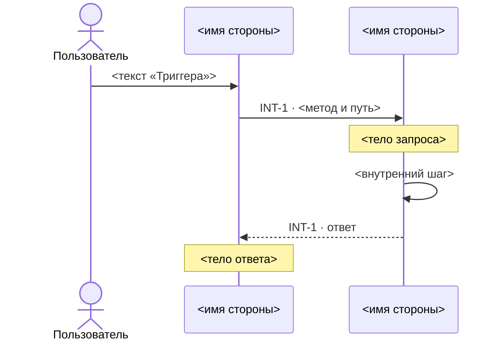
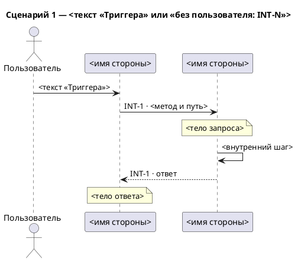

# Сценарная схема: что нарисовать, как записать, как проверить

Сценарная схема — по диаграмме на сценарий: что происходит от действия пользователя до последнего
вызова, по времени, с ответами, телами запросов и внутренними шагами сервисов. В `SKILL.md` — тип,
формат, вход, чтение границы и контракта, список карточек с триггерами, все вопросы, в том числе о
сценариях и внутренних шагах, ответ аналитика, отчёт. Здесь — всё о файле сценарной схемы.

## Что ещё берёшь из карточки

| Поле | Зачем |
|---|---|
| «Триггер» | текст стрелки от пользователя и заголовка сценария |
| «Контракт (запрос)» или «Контракт (событие)» | тело запроса или события |
| «Контракт (ответ)» | тело ответа |

Тело — имена полей, которые перечисляет контракт: в фигурных скобках `{ … }` (скобки внутри пути,
`/items/{id}`, — не тело), списком после слова «тело» или подпунктами под полем контракта; из
списка и подпунктов берёшь только имя поля, без типа и пояснений; у события — список полей после его
имени. Метод и путь, имена сервисов, кто кого вызывает и прочий текст контракта — не тело. Тела
нет — пометки нет.

## Что рисуешь в сценарии

Участники сценария — стороны его карточек по порядку первого появления в нём; алиасы `S1`, `S2`…
заново в каждом сценарии.

- **Пользователь.** Сценарий начинает действие человека → первый участник `Пользователь` и стрелка от
  него к первой стороне первой карточки с текстом её «Триггера». Сценарий без пользователя
  начинается сразу с запроса.
- **Запросы** — вид, направление и подпись по `SKILL.md` Step 2, строка — по таблице «Строки».
- **Тело запроса или события** — сразу после стрелки пометка над её получателем с телом; у цепочки —
  только после первого запроса.
- **Порядок карточек.** Сценарий — ряд карточек: все, что аналитик назвал в нём не «внутри INT-N»,
  в названном порядке — со словом «затем» или простым перечислением. Карточки, названные «внутри
  INT-N», — между запросом INT-N и её ответом, в названном порядке; у цепочки — после запроса того
  звена, получатель которого их вызывает. Каждая следующая карточка, в ряду и внутри, идёт после всех
  строк предыдущей: её ответа и всего, что в неё вложено; у события ответа нет — после его стрелки и
  пометки. «Затем» не вкладывает: карточка после «затем» — в ряду, даже если перед ней названа
  вложенная.
- **Ответ** — на каждое звено `→` и `←` пунктирная стрелка обратно, подпись `INT-N · ответ`, после
  вызовов, вложенных в это звено. У события и `↔` ответа нет. У цепочки `A → B → C` порядок такой:
  запрос `A → B`, запрос `B → C`, ответ `C → B`, ответ `B → A`.
- **Тело ответа** — одна пометка на карточку с телом из «Контракт (ответ)»: сразу после последнего
  ответа карточки, над тем, кто его получил. У цепочки `A → B → C` это ответ `B → A`.
- **Внутренний шаг** — стрелка сервиса на себя с текстом шага, там, где назвал аналитик.

Ответа пользователю и ошибок нет — их нет в карточках. Полос активности, `group`, `alt` и `loop` нет:
несбалансированный `activate` молча ломает Mermaid, а границ блоков карточки не задают.

## Строки

`S1` и `S2` — алиасы сторон A и B границы карточки, `U` — пользователь.

| Что | Mermaid | PlantUML |
|---|---|---|
| действие пользователя | `U->>S1: <текст «Триггера»>` | `U -> S1 : <текст «Триггера»>` |
| запрос `A → B` | `S1->>S2: INT-N · …` | `S1 -> S2 : INT-N · …` |
| запрос `A ← B` | `S2->>S1: INT-N · …` | `S2 -> S1 : INT-N · …` |
| `A ↔ B` | `S1<<->>S2: INT-N · …` | `S1 <-> S2 : INT-N · …` |
| `событие: A → B` | `S1-)S2: INT-N · …` | `S1 ->> S2 : INT-N · …` |
| цепочка `A → B → C` | `S1->>S2: …` и `S2->>S3: …` | `S1 -> S2 : …` и `S2 -> S3 : …` |
| ответ — обратно своему запросу | на `S1->>S2` — `S2-->>S1: INT-N · ответ`; на `S2->>S1` — `S1-->>S2: INT-N · ответ` | на `S1 -> S2` — `S2 --> S1 : INT-N · ответ`; на `S2 -> S1` — `S1 --> S2 : INT-N · ответ` |
| пометка над `S2` | `Note over S2: <тело>` | `note over S2 : <тело>` |
| внутренний шаг `S2` | `S2->>S2: <шаг>` | `S2 -> S2 : <шаг>` |

## Файл

Один файл на все сценарии, рядом со спекой. Mermaid → `interaction_scenarios.md`, раздел и блок
`mermaid` на сценарий; PlantUML → `interaction_scenarios.puml`, блок `@startuml` … `@enduml` на
сценарий. Mermaid ломается молча, поэтому два правила без исключений: алиас — только `S1`, `S2`… и `U`
у пользователя (дефис, пробел или кириллица в алиасе рвут схему; имя стороны идёт после `as`); `;` и
`#` в подписях, пометках и тексте «Триггера» замени на `#59;` и `#35;`.

````markdown
# Сценарии взаимодействий — <KEY>

> Проекция INT-карточек `technical_specification.md` <источник сценариев>. Руками не править:
> изменились карточки — перерисуй скиллом `interaction-diagram`.

## Сценарий 1 — <текст «Триггера» или «без пользователя: INT-N»>


````



Скелет — форма, а не пример: `<…>` заменяются значениями, строк ровно столько, сколько участников,
запросов, ответов, пометок и шагов, каждая — по таблице «Строки». Кроме шапки, заголовков, `actor`,
`participant`, стрелок и пометок ничего не пиши.

- `<KEY>` — имя папки, в которой лежит спека.
- `<источник сценариев>` — «по сценариям со слов аналитика», если аналитик ответил на вопрос о
  сценариях; иначе «по карточке на сценарий, сценарии не подтверждены».

## Самопроверка — перечитай записанный файл

1. Сценариев столько, сколько назвал аналитик, и ещё по одному на каждую карточку, которую он не
   назвал; без ответа — по карточке на сценарий. В каждом — его карточки в его порядке: вложенные —
   между запросом и ответом той, внутри которой идут; карточка ряда — после всех строк предыдущей в
   ряду.
2. Участники сценария — стороны его карточек, имя — сторона карточки до первой ` (`; алиасы `S1`,
   `S2`… по порядку появления, у пользователя `U`.
3. Каждый запрос — строка таблицы «Строки» для границы своей карточки; после `INT-N ·` — ровно токен
   метода с путём или имя события, звену без метода — только `INT-N`.
4. У каждого звена `→` и `←` — ответ пунктиром; у события и `↔` ответа нет.
5. У карточки с телом запроса или события — пометка после её первой стрелки, с телом ответа — после
   её последнего ответа; других пометок нет, пустых тоже.
6. Внутренние шаги — только названные аналитиком.
7. Где аналитик ответил, пункты 1–6 сверяй с его ответом, а не с карточкой; где не ответил — с
   таблицей «Вопрос без ответа» из `SKILL.md`.
8. `<…>` из скелета не осталось.

## Отчёт

Строки те же, что в `SKILL.md` Step 5, кроме двух: вместо «стрелок» — «сценариев: N»; вместо
«порядок» — «сценарии: по сценариям со слов аналитика» или «сценарии: по карточке на сценарий,
сценарии не подтверждены» — той же фразой, что в шапке файла.
В «со слов аналитика» — и ответы о сценариях и внутренних шагах.
