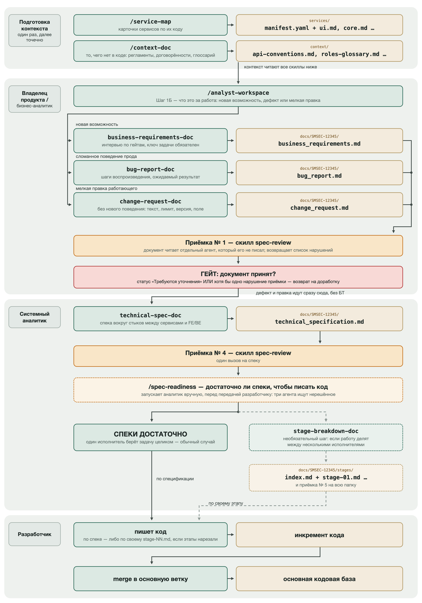
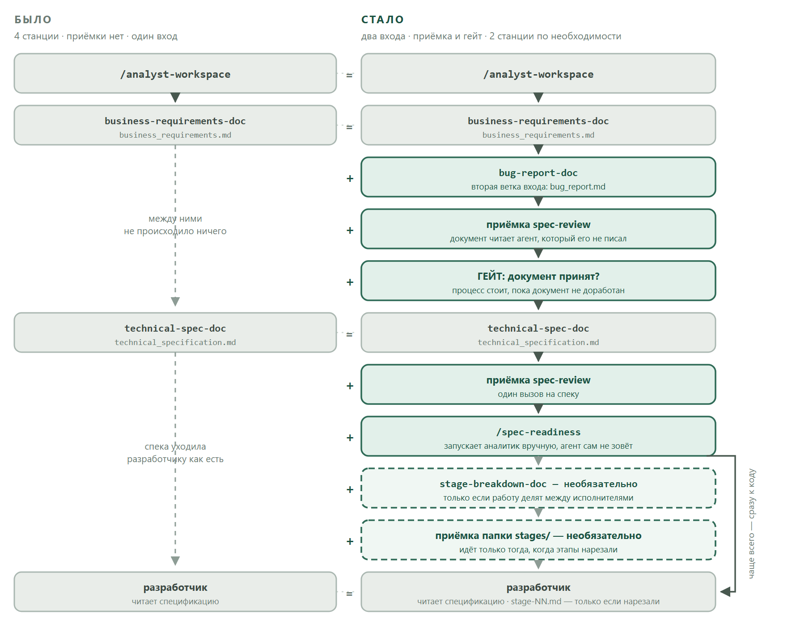
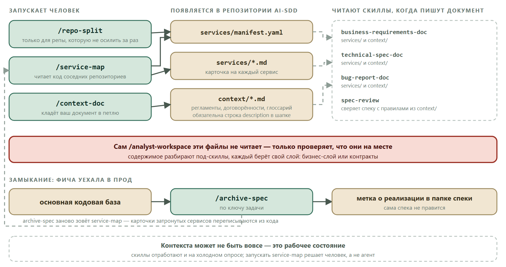
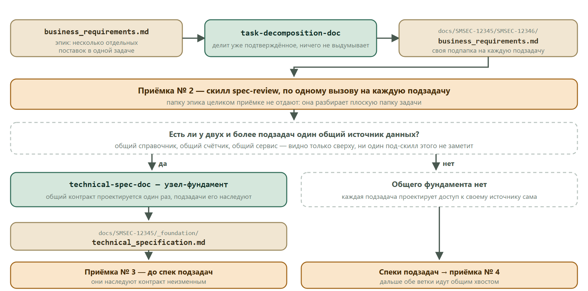

> Архив. Этот файл — прежний README, заменён короткой версией 2026-09-21. Актуальное описание — в [README.md](../README.md) в корне репозитория.

# Работа с процессом SDD и скиллами для формирования БТ и аналитики

## Оглавление

- [Скиллы](#скиллы)
  - [Установка скиллов](#установка-скиллов)
- [Описание](#описание)
  - [Схема процесса: от идеи до передачи задач разработчику](#схема-процесса-от-идеи-до-передачи-задач-разработчику)
  - [Что изменилось в процессе](#что-изменилось-в-процессе)
- [Этап 1. Формирование контекста приложения](#этап-1-формирование-контекста-приложения)
  - [В чём разница?](#в-чём-разница)
  - [О формировании контекста](#о-формировании-контекста)
  - [Шаг 1. Создание репозитория контекста системы](#шаг-1-создание-репозитория-контекста-системы)
  - [Шаг 2. Наличие полной кодовой базы локально](#шаг-2-наличие-полной-кодовой-базы-локально)
  - [Шаг 3. Формирование контекста системы на основании её кода](#шаг-3-формирование-контекста-системы-на-основании-её-кода)
  - [Шаг 4. Папка `context/` — то, чего нет в коде](#шаг-4-папка-context--то-чего-нет-в-коде)
- [Этап 2. Работа над БТ и аналитикой с помощью скилла `analyst-workspace`](#этап-2-работа-над-бт-и-аналитикой-с-помощью-скилла-analyst-workspace)
  - [Приёмка: скилл `spec-review` после каждого документа](#приёмка-скилл-spec-review-после-каждого-документа)
  - [Роли «Владелец продукта / бизнес-аналитик»](#роли-владелец-продукта--бизнес-аналитик)
  - [Роль «Системный аналитик»](#роль-системный-аналитик)
  - [Роль «Разработчик»](#роль-разработчик)
- [Этап 3. Обновление контекста и завершение работы над фичей](#этап-3-обновление-контекста-и-завершение-работы-над-фичей)
- [Полезные советы](#полезные-советы)

---

## Скиллы

- **analyst-workspace** — точка входа, ведёт вас по процессу и сам зовёт нужный под-скилл:
  - business-requirements-doc
  - bug-report-doc
  - change-request-doc _(мелкая правка работающего: без БТ, сразу в спеку)_
  - task-decomposition-doc
  - technical-spec-doc
  - stage-breakdown-doc _(необязательный)_
- **spec-review** — приёмка записанного документа
- **spec-readiness** — проверка спеки на готовность к разработке
- **service-map** — описания сервисов по их коду
- **repo-split** — разрез слишком большой репы для `service-map`
- **context-doc** — ваш документ кладётся в папку контекста
- **archive-spec** — архивация фичи, уехавшей в прод

Имена под-скиллов знать не нужно: вы вызываете `analyst-workspace`, а он сам решает, какой из них запустить и в каком порядке.

### Установка скиллов

Нужны только `git` и `bash` (на Windows — Git Bash), доступ к репозиторию со скиллами тот же, что для `git clone`.

**Первый раз.** Скопируйте из этого репозитория одну папку `agent-version/analyst-skills-update/` в `.gigacode/skills/` рабочего репозитория со спеками и вызовите в чате `/analyst-skills-update` — скилл установит все остальные. То же самое из терминала, из корня рабочего репозитория:

```
bash .gigacode/skills/analyst-skills-update/reference/skills.sh
```

**Дальше.** Обновление — той же командой `/analyst-skills-update` в чате, терминал не нужен. Скрипт `reference/skills.sh` живёт внутри скилла и обновляется вместе с ним: он клонирует репозиторий со скиллами во временную папку и копирует из его `.gigacode/` каждую папку со `SKILL.md` вместе с `reference/` в `.gigacode/skills/` рабочего репозитория, печатает версии; стенд `_skill-eval` и CHANGELOG не копирует. Другая целевая папка — аргументом (`… skills.sh .claude/skills`), ветка или тег — переменной `SDD_SKILLS_REF`, другой адрес репозитория — `SDD_SKILLS_REPO`. Запускать через `bash …`, а не `./…`: в корпоративных образах запуск файлов из домашней папки бывает запрещён.

Вручную: скопируйте папки скиллов из `agent-version/` этого репозитория в свою рабочую папку `.gigacode`.

В этом репозитории скиллы лежат в папке `agent-version/`: по отдельной папке на скилл, в каждой свой `SKILL.md`.

Рекомендуемое место размещения — папка `.gigacode` репозитория **AI-SDD** (см. ниже).

Если вы работаете в **GigaCode Desktop**, импортируйте скиллы (из списка выше) через меню **Навыки → Загрузить навык → SKILL.md** (например, `/.gigacode/analyst-workspace/SKILL.md`).

---

## Описание

После установки вы получаете набор скиллов заточенных на:

- формирования репозитория контекста приложения;
- формирования бизнес-требований (БТ) на основании идеи нового функционала/доработки счуществующего;
- формирования аналитики на основании бизнес-требований или баг-репорта;
- формирования баг-репорта на основании найденного дефекта;
- при необходимости — разбиения готовой спецификации на отдельные задачи, если работу делят между несколькими исполнителями.

> **Конечный продукт процесса — спецификация.** Её достаточно, чтобы отдать задачу в разработку. Всё, что идёт после неё на схеме, — необязательные шаги, которые нужны не в каждой задаче.

### Схема процесса: от идеи до передачи задач разработчику



**Как читать схему:**

- ⬜ слева — **роли**: кто держит документ в руках на этом отрезке;
- 🟩 **скиллы и действия** (`/analyst-workspace` и под-скиллы, которые он зовёт);
- 🟧 **артефакты** — файлы, которые скиллы генерируют в репозитории **AI-SDD**;
- 🟨 **приёмка** — независимая проверка записанного документа, идёт после каждого из них;
- 🟥 **гейт** — место, где процесс останавливается, пока документ не доработан;
- сплошные стрелки и сплошные рамки — **основной маршрут**, он проходится всегда;
- пунктир — **необязательное**: `/spec-readiness` вы запускаете сами, а нарезка на этапы нужна далеко не в каждой задаче.

**Артефакты:**

*Обычная работа над фичей:*
- `business_requirements.md` — **бизнес-требования (БТ)**;
- `technical_specification.md` — **спецификация / аналитика**. Это результат процесса: по ней пишут код;

 ```
 AI-SDD/
 └── docs/
     └── SMSEC-12345/
         └── business_requirements.md
         └── technical_specification.md
 ```
  
*Работа над багом:*
- `bug_report.md` — **баг-репорт**, документ-источник для спеки на починку;
- `technical_specification.md` — **спецификация / аналитика**. Это результат процесса: по ней пишут код;

```
AI-SDD/
└── docs/
   └── SMSEC-12345/
       └── bug_report.md
       └── technical_specification.md
 ```
  
*Обычная работа над большой фичей, требующей декомпозиции:*
- `business_requirements.md` — **бизнес-требования (БТ)**;
- `technical_specification.md` — **спецификация / аналитика**. Это результат процесса: по ней пишут код;
- `stages/stage-01.md`, `stages/stage-02.md`, … — _необязательно:_ спека, порезанная на отдельные задачи, когда над ней работают несколько человек параллельно.

```
AI-SDD/
└── docs/
   └── SMSEC-12345/
       └── business_requirements.md
       └── technical_specification.md
             └── stages
               └── stage-01.md
 ```

### Что изменилось в процессе



Если вы работали по прошлой схеме, изменилось четыре вещи.

**1. Появилась вторая ветка — дефект.** Раньше вход был один: идея → БТ. Теперь скилл на первом же шаге спрашивает, что за работа. Сломанное поведение прода идёт не в бизнес-требования, а в `bug_report.md`: шаги воспроизведения, фактический и ожидаемый результат, критичность. Дальше по нему пишется обычная спецификация — с пометкой, что это починка.

**1.1. И третья — мелкая правка работающего.** Намеренное изменение, решение о котором уже принято, — текст кнопки, лимит, версия библиотеки, поле в ответе — идёт в `change_request.md`. БТ на него не заводится: по запросу сразу пишется спецификация.

**2. После каждого записанного документа идёт приёмка.** Документ читает отдельный агент, у которого в контексте нет ни вашего интервью, ни черновиков. Он возвращает список нарушений с цитатами. Это ловит то, что автор документа у себя не видит.

**3. Появилась проверка спеки на готовность к разработке.** Приёмка отвечает на вопрос «форма верна». Скилл `spec-readiness` отвечает на другой — «можно ли по этому писать код». Запускается вручную, перед передачей разработчику. Спецификация при этом остаётся конечным продуктом процесса: в большинстве задач её достаточно, и никаких шагов после неё не нужно.

**3.1. Если работу делят между несколькими исполнителями** — спеку можно нарезать на этапы работ, по самодостаточному файлу на этап. Это **необязательный шаг**: он нужен, когда над задачей параллельно работают несколько человек, а не в каждой задаче.

**4. Появилась папка `context/`.** Раньше единственным входом знания был скан кода (`services/*.md`). Регламенты, договорённости со смежниками, глоссарий аббревиатур, правила оформления API подключить было некуда — теперь есть куда (см. Шаг 4).

---

## Этап 1. Формирование контекста приложения

Перед началом продуктивной работы со скиллами необходимо сформировать репозиторий с контекстом знаний о системе. Наличие контекста позволяет скиллам точнее задавать вопросы и заранее предлагать на них ответы на основании уже существующего в системе функционала.

### В чём разница?

**Пример задачи:** нужно добавить вкладку с графиком нагрузки для администратора системы.

**Вопрос агента без контекста:**

> Для какой роли доступен новый функционал?
>
> - Администратор безопасности // агент выдумал сам
> - Введу сам в поле Other
> - Не знаю, заполню позже

**Вопрос агента с контекстом:**

> Для какой роли доступен новый функционал?
>
> - Администратор системы (`ADM`, рекомендую)
> - Мастер бизнес-администратор (`CA_MBA`)
> - Бизнес-администратор (`CA_BA`)
> - Другой (введу в поле Other)

### О формировании контекста

Формирование контекста приложения — разовая активность по созданию базы знаний о текущем состоянии функционала. В дальнейшем база знаний обновляется точечно, исходя из измененных сервисов (сканируются только те сервисы, которые затрагивались спецификацией).

Контекст живёт в двух папках, и они не заменяют друг друга:



- `services/` — собирается **агентом из кода**. Что сервис умеет, что отдаёт наружу, какими данными владеет, кто его вызывает.
- `context/` — наполняете **вы руками**. То, чего в коде нет и не будет: регламенты, договорённости с внешними командами, глоссарий, правила оформления.

> ⚠️ Контекста может не быть вовсе — это рабочее состояние, а не ошибка. Скиллы отработают и на холодном опросе, просто вопросов вам зададут больше, а качество ответов будет ниже.

### Шаг 1. Создание репозитория контекста системы

Создайте новый репозиторий, в котором будет жить контекст вашей системы и все спецификации по задачам.

Для лучшей синхронизации рекомендуем назвать репозиторий **AI-SDD**.

### Шаг 2. Наличие полной кодовой базы локально

Сформируйте папку (например, с названием вашей системы), в которую склонируйте:

- все связанные с системой репозитории с кодом (последние актуальные ветки);
- репозиторий документации **AI-SDD**.

**Пример иерархии папок:**

```
Arsenal/
├── AI-SDD/
├── ui/
├── core/
├── security-gateway/
└── ...
```

### Шаг 3. Формирование контекста системы на основании её кода

**3.1.** Запустите диалог с GigaCode в папке `AI-SDD`:

- **GigaCode Desktop:** в диалоге выберите локальную папку `AI-SDD` (см. Шаг 2);
- **GigaCode CLI:** перейдите в папку `AI-SDD` и запустите `gigacode`.

**3.1.1** Выберите ризонинг модель (на данный момент это Minimax и Deepseek)

**3.2.** Вызовите скилл `service-map`:

- **GigaCode Desktop:** `/service-map`
- **GigaCode CLI:** `/skills service-map`

**3.3.** Скилл просканирует репозитории сервисов в корневой папке, сформирует их список и предложит автоматически составить по ним описания.

> ⚠️ Скилл читает до шести сервисов параллельно. Если сервисов больше десяти, он предупредит об этом и предложит разбить прогон по именам: `/skills service-map auth geo billing`.

Вы так же можете запустить несколько терминалов/сессий и в каждой сканировать свою часть сервисов по именам — для ускорения получения контекста.

**3.4.** После прохода скилла по всем сервисам в папке `AI-SDD` появится следующая структура:

```
AI-SDD/
└── services/
    ├── manifest.yaml   # список сервисов и пути к ним; ведёт человек
    ├── ui.md           # сгенерированное описание сервиса
    └── core.md         # сгенерированное описание сервиса
```

`manifest.yaml` ведёте вы: состав сервисов и поле `notes` — договорённости команды, которых нет в коде. При каждом скане `notes` дословно переносится в карточку сервиса, в секцию «Заметки команды»; сам скилл в это поле не пишет.

⚠️ Если описание какого-то сервиса не сгенерировалось или вышло некачественным — перечитайте этот сервис, назвав его имя:

```bash
/skills service-map my-missing-service
```

Карточка при этом перезаписывается целиком: обновить отдельные разделы вручную нельзя. Точечно, по задетому, карточки обновляет архивация фичи (см. **Этап 3**) — она сама передаёт скиллу список того, что изменилось.

**3.5.** Если один из репозиториев настолько велик, что скилл на нём молча выдыхается или возвращает описание втрое короче правды — разрежьте его на куски:

```bash
/skills repo-split my-huge-monolith
```

Скилл посчитает связность пакетов, предложит границы разреза и допишет куски в `services/manifest.yaml`. Границы разреза утверждаете вы. После этого `service-map` сканирует каждый кусок отдельно.

> ⚠️ Для репы, которая читается целиком, `repo-split` **не нужен** — это инструмент только для монолита.

**3.6.** Запушьте получившийся контекст, чтобы ваши коллеги могли с ним работать.

### Шаг 4. Папка `context/` — то, чего нет в коде

Скан кода отвечает на вопрос «как система устроена сейчас». Он не отвечает на вопросы «как у нас принято оформлять API», «о чём мы договорились со смежниками», «что означает эта аббревиатура», «какие нормативы записаны в регламенте». Для этого есть папка `context/`.

**4.1.** Положите документ в петлю:

- **GigaCode Desktop:** `/context-doc путь/к/файлу.docx`
- **GigaCode CLI:** `/skills context-doc путь/к/файлу.docx`

На вход годится почти что угодно: `txt`, `csv`, `html`, `json`, `xlsx`, `docx`, `pdf`, несколько файлов, папка целиком или текст, вставленный прямо в чат.

**4.2.** Скилл перенесёт содержимое в Markdown **дословно** — он переносчик, а не редактор — и предложит строку `description`. Эту строку утверждаете вы.

**4.3.** В репозитории появится:

```
AI-SDD/
└── context/
    ├── api-conventions.md   # правила оформления API
    ├── scb-protocol.md      # договорённость с внешней командой
    └── roles-glossary.md    # расшифровка ролей и аббревиатур
```

Шапка каждого файла:

```markdown
---
description: Правила оформления REST API: версионирование, формат дат, коды ошибок
source: confluence/ARCH/API-Guidelines.docx
updated: 2026-08-21
---
```

> ⚠️ **Строка `description` обязательна.** Скиллы ищут файлы контекста именно по ней. Файл без `description` для процесса не существует — его просто не найдут. Если вы клали файлы в `context/` руками, запустите `/skills context-doc` **без аргументов**: скилл найдёт такие файлы и допишет строку, не трогая текст.

**4.4.** Что с этими файлами делают скиллы:

| Скилл | Что берёт из `context/` |
| --- | --- |
| `business-requirements-doc` | процесс, потребителей, роли, ограничения, сроки |
| `technical-spec-doc` | правила оформления контрактов, факты о чужих системах |
| `bug-report-doc` | договорённости и регламенты по затронутому процессу |
| `change-request-doc` | документ, где записано решение о правке, если оно записано |
| `spec-review` | сверяет готовую спеку с записанными правилами оформления |

> ⚠️ Правило из `context/` применяется молча, и агент **не проверяет**, совпадает ли оно с тем, что сервисы делают на самом деле. Если в регламенте написано `/v1/`, а все живые сервисы отдают `/api/`, расхождение всплывёт только на интеграции. Держите `context/` в актуальном состоянии.

---

## Этап 2. Работа над БТ и аналитикой с помощью скилла `analyst-workspace`

1. Владелец продукта / бизнес-аналитик / системный аналитик устанавливают себе скиллы работы с БТ и аналитикой (см. раздел **Установка скиллов**).

> ⚠️ Крайне желательно что бы в этот момент был уже сгенерирован контекст системы, иначе скилл будет вести холодный опрос и его полезность не будет раскрыта в полной мере.

2. Скачивают себе на ПК репозиторий **AI-SDD**. _Качать всю кодовую базу со всеми репозиториями не нужно!_
3. В папке `AI-SDD` (см. Шаг 3.1) запускают скилл `/analyst-workspace`.

> **⚠️ Выбор модели**
> Для стабильной и более качественной работы скиллов рекомендуем использовать модель **MiniMax-M3** или **DeepSeek-V4-Flash**.
>
> - **GigaCode CLI:** `/model` → выберите `MiniMax-M3`
> - **GigaCode Desktop:** в правом нижнем углу в выпадающем списке выберите `MiniMax-M3`

> **Если работа прервалась** — запустите `/analyst-workspace` снова и выберите **«Продолжить начатое»**: скилл сверится с папкой задачи на диске, покажет, что уже готово и что осталось, и продолжит с нужного шага.

### Приёмка: скилл `spec-review` после каждого документа

Это единственное место процесса, которое вам **не нужно запускать самим**: `analyst-workspace` зовёт приёмку сам, после каждого записанного документа. После спеки и этапов он называет результат одной строкой. После документа сверху — БТ, баг-репорта или запроса на правку — отдельной строки нет: находки приходят сразу вопросом «Поправить документ сейчас или идти дальше как есть», а если находок и открытых пунктов нет, процесс молча идёт дальше.

**Зачем.** Документ читает отдельный агент, у которого в контексте нет ни вашего интервью, ни черновиков, ни того, что автор имел в виду. Он видит ровно то, что увидит читатель документа через неделю. Усилением самопроверки внутри пишущего скилла этого не добиться.

**Что вы увидите в диалоге:**

> приёмка `technical_specification.md`: нарушений нет

или

> приёмка `technical_specification.md`: 2 нарушения
>
> артефакт: docs/SMSEC-12345/technical_specification.md
> тип: тех-спецификация
> нарушений: 2
>
> 1. §2 INT-2, строка 88 — конкретный путь под меткой «🟡 к валидации»
>    «Контракт (запрос): `GET /v1/sessions/active`»
>    → Подтвердите путь у владельца сервиса и смените метку на «подтверждено аналитиком» — либо уберите путь и оставьте словесное описание.
> 2. §7, строка 241 — FR-3 не покрыт ни одной INT-карточкой
>    «| FR-3 | — | |»
>    → Требование доедет до разработки без контракта. Вернитесь в `technical-spec-doc` проходом доработки.
>
> утверждений, стоящих только на памяти аналитика: 3

У каждого пункта — цитата и номер строки: без цитаты находки не бывает. Последняя строка счётная и нарушением не является: это пометки «🔵 подтверждено аналитиком» с конкретным путём или полем — их стоит перепроверить при интеграции.

**Гейт.** После документа сверху процесс останавливается, если статус документа — «Требуются уточнения» **или** приёмка вернула хотя бы одно нарушение. Дальше скилл не пойдёт, пока вы не выберете «Доработать» или явно не примете документ как есть.

**Если приёмка мешает** — например, вы правите текст короткими итерациями и проверять хотите в конце — выключите её флагом в строке вызова:

```bash
/skills analyst-workspace --no-review
```

> ⚠️ Флаг выключает приёмку **целиком и на всю сессию**: «на спеки проверяй, на БТ не надо» не бывает. Гейт при этом остаётся работать по статусу документа. И флаг работает только в той строке, которой вы позвали скилл — фраза «без приёмки» в середине переписки флагом не является.

### Роли «Владелец продукта / бизнес-аналитик»

1. Создайте ветку для новой задачи:
   ```bash
   git checkout -b feature/SMSEC-12345
   ```
2. После запуска скилла выберите **«Бизнес: Переводим Идею в БТ, баг — в баг-репорт, правку — в запрос»**.
3. Скилл отдельным вопросом уточнит, что это за работа. Дальше ветки расходятся.

#### Ветка 1. Новая идея → бизнес-требования

4. В интерактивном диалоге со скиллом заполните описание идеи и дополнительную информацию, необходимую для формирования качественного БТ.
5. Когда вся необходимая информация заполнена, автоматически сформируется файл бизнес-требований:
   ```
   AI-SDD/
   └── docs/
       └── SMSEC-12345/
           └── business_requirements.md
   ```
6. Скилл сам запустит приёмку. Нашлись нарушения или открытые пункты — он спросит, поправить документ сейчас или идти дальше; не нашлись — продолжит молча.
7. Прочитайте и провалидируйте корректность сгенерированного файла бизнес-требований.

#### Ветка 2. Найден дефект → баг-репорт

4. Опишите, что сломалось. Скилл проведёт вас по пяти вопросам: затронутый бизнес-процесс, шаги воспроизведения, фактический результат, ожидаемый результат, критичность и срочность.
5. Сформируется файл баг-репорта:
   ```
   AI-SDD/
   └── docs/
       └── SMSEC-12345/
           └── bug_report.md
   ```
6. Скилл сам запустит приёмку. Нашлись нарушения или открытые пункты — он спросит, поправить документ сейчас или идти дальше; не нашлись — продолжит молча.

> ⚠️ **Скилл не ищет причину дефекта и не читает код.** Его работа — зафиксировать шаги воспроизведения и разницу с ожидаемым результатом. Причину найдёт разработчик, а «как должно быть» станет требованием в спецификации на починку.

#### Ветка 3. Мелкая правка работающего → запрос на правку

4. Опишите, что нужно поменять: текст кнопки, лимит, версию библиотеки, поле в ответе. Решение о правке уже принято — скилл его не обсуждает, а записывает.
5. Скилл сам разложит описание по пяти строкам тронутого — контракт, данные, интерфейс, зависимость, конфигурация — и скажет, правка это или уже доработка. Если объём выше порога, он предложит идти через БТ; решаете вы.
6. Дальше пять вопросов: затронутый бизнес-процесс, как сейчас, как должно стать, как проверят, критичность и срочность.
7. Сформируется файл запроса на правку:
   ```
   AI-SDD/
   └── docs/
       └── SMSEC-12345/
           └── change_request.md
   ```
8. Скилл сам запустит приёмку — так же, как в ветках 1 и 2. БТ на правку не заводится: по запросу сразу пишется спецификация.

#### Если задача оказалась эпиком

Если в задаче несколько отдельно поставляемых кусков, скилл предложит разрезать её на подзадачи и покажет предлагаемое деление. Ничего нового при этом не придумывается — уже подтверждённые требования просто раскладываются по подзадачам.



Вы подтверждаете деление, называете реальные ключи подзадач в трекере и порядок сборки. После этого скилл посмотрит, не опираются ли две и более подзадачи на один общий источник данных — и, если да, предложит спроектировать этот общий контракт один раз, отдельным узлом-фундаментом.

> ⚠️ У узла-фундамента **не будет своего БТ** — это слой реализации, а не отдельная бизнес-поставка. Не ждите по нему интервью.

#### Передача аналитику

8. Если всё хорошо — запушьте результаты в общий репозиторий:
   ```bash
   git push origin feature/SMSEC-12345
   ```
9. Передайте название ветки или ссылку на неё в BitBucket / Source Control аналитику — для дальнейшего формирования аналитики.

### Роль «Системный аналитик»

1. Получите сигнал о готовности документа (например: «Я сгенерировал БТ по задаче SMSEC-12345, можешь скачать и смотреть»).
2. Скачайте себе локально ветку:
   ```bash
   git pull && git checkout feature/SMSEC-12345
   ```
3. Запустите скилл /analyst-workspace и выберите пункт **«Аналитика: Создаем Спецификацию на основе готового документа»**.
4. Укажите путь к документу. Это может быть БТ, баг-репорт или запрос на правку — все три артефакта являются корректными, тип работы скилл определит сам по имени файла.

#### Шаг А. Спецификация

5. В интерактивном диалоге со скиллом заполните описание и дополнительную информацию, необходимую для формирования качественной аналитики/спецификации.
6. Когда вся необходимая информация заполнена, автоматически сформируется файл спецификации:
   ```
   AI-SDD/
   └── docs/
       └── SMSEC-12345/
           ├── business_requirements.md
           └── technical_specification.md
   ```
7. Скилл сам запустит приёмку и покажет её результат строкой.
8. Прочитайте и провалидируйте корректность сгенерированного файла спецификации.

#### Шаг Б. Проверка готовности: скилл `spec-readiness`

Приёмка отвечает на вопрос заполнены ли все необходимые разделы». Она не отвечает на вопрос «можно ли по этому писать код» — и спецификация с `нарушений: 0` вполне может оказаться непригодной: разделы заполнены честно, а разработчик встанет на третий день на вопросе «а если запрос пришёл дважды» и закроет его выдумкой.

Перед тем как отдать спеку в разработку, запустите проверку готовности **вручную**:

`/spec-readiness docs/SMSEC-12345/technical_specification.md`

> ⚠️ Это единственный шаг процесса, который `analyst-workspace` **не вызывает сам**: после приёмки спеки он только напомнит о нём строкой. Если его не запустить, процесс пойдёт дальше.

Спеку прочитают три агента с чистым контекстом — **бэкенд**, **фронтенд** и **стык**. Каждый видит свои дыры и не видит чужих, а самая дорогая лежит ровно между ними. Четвёртый агент, **сверка**, ищет в спеке ответы на их вопросы и вычёркивает те, на которые ответ уже есть, — с дословной цитатой. Вы получите один список решений, которые разработчику иначе пришлось бы принять самому:

> спека: `docs/SMSEC-12345/technical_specification.md`
> ролей ответило: 3 из 3
> вопросов задано: 29 · закрыто цитатой: 22 (§3.3 — 4, каталог ошибок — 6, §4.2 — 9, §5.2 — 3) · осталось: 7
>
> §2 INT-1
> &nbsp;&nbsp;1. `POST /v1/passes` — что делает вторая доставка того же запроса
> &nbsp;&nbsp;2. `POST /v1/passes` — что возвращается, когда часть полей не прошла проверку
> §2 INT-3
> &nbsp;&nbsp;3. решение по заявке — проверяет ли сервер роль «Согласующий»
> §4.3
> &nbsp;&nbsp;4. строка списка — что показано, пока идёт запрос решения
> …
>
> открытых пунктов в §8 (❓ и ⚠️): 4 — не пересчитываю

Пункты сгруппированы по адресу в спеке, нумерация сквозная: отвечать можно «по седьмому». Последняя строка — справка: открытые пункты самой спеки скилл заново не считает.

Ответы на эти вопросы дописываются в спеку. Скилл сам ничего не правит и на диск не пишет.

#### Шаг В (необязательный). Разбиение на этапы работ

**На этом месте работа обычно закончена.** Спецификация — конечный продукт процесса: в ней есть контракты, критерии приёмки, роли и трассировка, и разработчик берёт задачу по ней. Ничего дополнительно нарезать не нужно.

Нарезка на этапы — инструмент под одну конкретную ситуацию: **над задачей будут работать несколько исполнителей параллельно**, и каждому нужен свой кусок, не пересекающийся с чужим.

| Нарезать этапы | Не нарезать |
| --- | --- |
| задачу делят между двумя и более исполнителями | задачу целиком берёт один человек |
| куски пойдут в работу параллельно и в разных ветках | работа идёт последовательно, одной веткой |
| исполнителям отдают задачи через агента генерации кода, и каждому нужен свой изолированный контекст | разработчик читает спеку сам |

> ⚠️ Не нарезайте «на всякий случай». Каждый `stage-NN.md` — это копия куска спеки; после нарезки у вас становится **два места**, где живёт одно и то же требование, и правку придётся вносить в оба.

Если нарезка нужна, скилл предложит её сам после приёмки спеки — согласитесь. Разрез считается по инвентарю стыков спеки, то есть по тому, кто чем владеет, а не по слоям «фронт отдельно, бэк отдельно».

Появятся файлы задач:

```
AI-SDD/
└── docs/
    └── SMSEC-12345/
        ├── business_requirements.md
        ├── technical_specification.md
        └── stages/
            ├── index.md      # карта этапов и порядок
            ├── stage-01.md
            └── stage-02.md
```

Дальше скилл запустит приёмку на всю папку `stages/`.

> ⚠️ **Каждый `stage-NN.md` самодостаточен.** Контракт, проверки, роли и трассировка скопированы в него из спеки дословно — исполнителю не нужно читать спецификацию целиком. Ради этого нарезка и делается.

#### Передача разработчику

9. Запушьте результаты в общий репозиторий:
   ```bash
   git push origin feature/SMSEC-12345
   ```
10. Передайте название ветки или ссылку на неё в BitBucket / Source Control разработчику.
    - **обычный случай:** «спека по SMSEC-12345 готова, ветка `feature/SMSEC-12345`»;
    - **если нарезали этапы:** добавьте номер этапа, который отдаёте именно этому исполнителю.

### Роль «Разработчик»

**Предварительные требования:** помимо локальных репозиториев, в которых вы обычно делаете доработки, у вас дополнительно склонирован репозиторий **AI-SDD**.

1. Получите сигнал о готовности аналитики (например: «Спека по SMSEC-12345 готова и запушена»).
2. Обновите состояние репозитория `AI-SDD` и переключитесь в ветку с документами:
   ```bash
   git pull && git checkout feature/SMSEC-12345
   ```
3. Откройте `docs/SMSEC-12345/technical_specification.md` — это ваш рабочий документ. В нём контракты, критерии приёмки, затронутые роли и трассировка до бизнес-требований.
4. Напишите код самостоятельно — либо натравите на спецификацию агента генерации кода.

**Если задачу разделили между несколькими исполнителями**, аналитик назовёт вам номер вашего этапа. Тогда откройте `docs/SMSEC-12345/stages/stage-02.md` — там лежит только ваш кусок, и он самодостаточен: спеку целиком читать не нужно.

> ⚠️ Если по ходу работы обнаружилось, что в документе чего-то не хватает, — не дописывайте недостающее по своему усмотрению. Вернитесь к аналитику: решение, принятое разработчиком молча, не попадёт ни в спеку, ни в контекст системы, и следующая задача о него споткнётся.

---

## Этап 3. Обновление контекста и завершение работы над фичей

### Роль «Разработчик» или «Системный аналитик»

1. После того как инкремент кода влит в кодовую базу системы - локально обновите репозитории сервисов которые были затронуты в рамках доработки:
   ```bash
   git pull && git checkout release/01.XXX.XX (или любая ваша актуальная ветка разработки по Git-процессу)
   ```
2. В репозитории аналитики запустите архивацию фичи. `/analyst-workspace` -> Доработка готова - обновить описание сервисов.
3. Агент перечислит, что именно архивирует, и дождётся вашего подтверждения — на эпике проверьте, что все подзадачи действительно уехали в прод. После подтверждения он проанализирует обновленные репозитории и изменит карточки затронутых сервисов, а так же добавит в папку спецификации фичи метку о ее реализации.
4. Запушьте получившиеся обновления в репозиторий контекста (свой AI-SDD).

> ⚠️ На эпике архивация обрабатывает узел-фундамент и все подзадачи разом — по ключу эпика, отдельно по каждой подзадаче запускать не нужно.

---

# Полезные советы

1. Перед работой над каждый инкрементом аналитики очищать контекст через команду /clear. Сформировали БТ - /clear, сформировали техническую спеку - /clear, хотите переключиться между задачами или обновить контекст приложения - /clear.
2. Для сложных аналитических задач использовать модели с ризонингом, Minimax/Deepseek.
3. Содержите контекст своих сервисов в актуальном состоянии и, при необходимости, подкладывайте агенту дополнительные файлы с той информацией, которую ему полезно знать в рамках решения текущей задачи.
4. Вы можете вносить в GIGACODE.md (или любой другой .md файл, который импортируете в GIGACODE.md) дополнительную общую информацию о системе, которую полезно будет знать агенту для решения большинства задач (н.п. Список существующих ролей).
5. Не пересказывайте результат приёмки своими словами и не сокращайте его — список уже написан коротким. Если нарушений много, проще выбрать «Доработать» и дать скиллу переписать документ, чем править руками.
6. Не нарезайте спеку на этапы по умолчанию — в большинстве задач она самодостаточна. Нарезка нужна только тогда, когда работу реально делят между несколькими исполнителями. Если всё же нарезаете — запускайте `spec-readiness` **до** нарезки, а не после: дыра, найденная в спеке, правится в одном файле; та же дыра, разъехавшаяся по пяти файлам задач, правится в пяти.
7. Не просите скиллы дописать контракт к чужому сервису, помеченному 🔵 или 🟡. Пометка означает «это не наша зона, здесь нужно подтверждение» — выдуманный контракт хуже честного «уточнить у интегратора».
8. Если документ пролежал между сессиями — не считайте его принятым. Запустите на него приёмку заново: правило простое, новая редакция на диске — новая приёмка.
