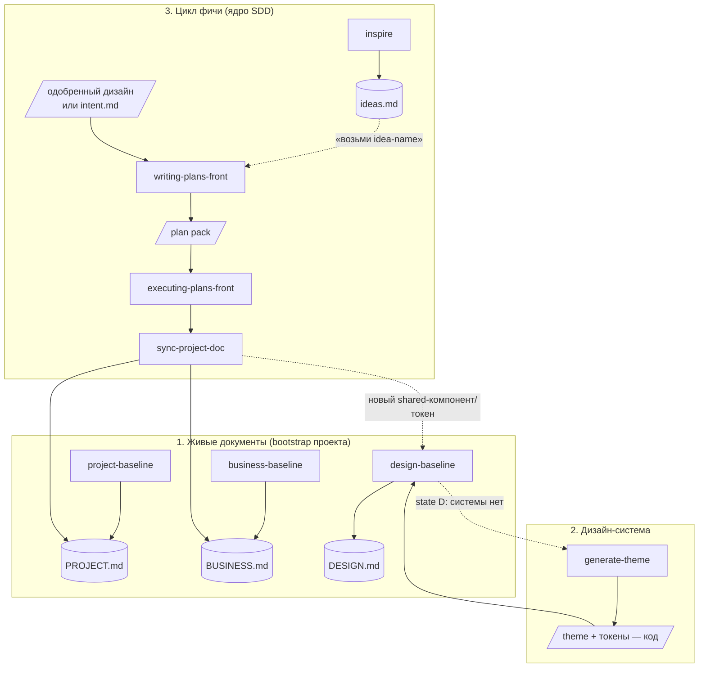

# Front-Loop Pipeline — карта и шпаргалка

Фронтовый SDD-пайплайн из **8 скиллов**. Три живых документа + цикл разработки фич.
**Оркестратора нет** — скиллы зовутся по имени (`/skills <name>`), поток само-секвенится
через хендоффы в каждом скилле. Эта страница — «одна дверь»: посмотрел состояние → понял
следующий шаг.

## Три живых документа (кто что пишет)

| Документ | Заводит (Create/Refine) | Ведёт по инкременту | Модель владения |
|----------|--------------------------|---------------------|-----------------|
| `docs/dev/PROJECT.md` (техническое) | **project-baseline** | **sync-project-doc** — блоки «Факты» | блоки: «Факты» = sync; «Почему»/§1/§9/§10 = человек |
| `docs/dev/BUSINESS.md` (бизнес) | **business-baseline** | **sync-project-doc** — `## Capabilities` | секции: только Capabilities = sync; остальное = человек |
| `docs/dev/DESIGN.md` (дизайн) | **design-baseline** | **sync ФЛАГает**, не пишет | design-baseline — единственный писатель |

Прочие артефакты: `docs/dev/ideas.md` (только **inspire**, append-only); theme/token-**код** в
проекте (создаёт/перегенеривает **generate-theme**); plan pack
`docs/dev/plans/<feature>/` (пишет **writing-plans-front**, статус ведёт **executing-plans-front**).

Каждый baseline регистрирует свой указатель (`## Project/Business Context`, `## Design System`)
в init-файле раннера (`CLAUDE.md`/`GIGACODE.md`/`AGENTS.md`), чтобы доки находились и без скилла.

## Поток



## Состояние → следующий шаг (шпаргалка)

| Ситуация | Делай |
|----------|-------|
| Новый/незнакомый проект, нет `docs/dev/` | **project-baseline** и **business-baseline** (+ **design-baseline**, если дизайн-система есть) |
| Есть код, нет `PROJECT.md` | **project-baseline** (Create) |
| `PROJECT.md`/`BUSINESS.md` устарел (накопился дрейф) | соответствующий **baseline Refine** |
| Дизайн-системы нет вовсе (state D) | **generate-theme** (создать) → потом **design-baseline** (задокументировать) |
| Есть библиотека/токены, но нет `DESIGN.md` | **design-baseline** (Create) |
| Не знаю, что строить дальше | **inspire** → идея в `ideas.md` |
| Есть одобренный дизайн / идея из `ideas.md` — пора строить | **writing-plans-front** («возьми idea-name из ideas.md», если из inspire) |
| План написан и **одобрен человеком** | **executing-plans-front** |
| План исполнен и ревью пройдено | **sync-project-doc** (свернуть инкремент в живые доки) |
| sync сказал «новый shared-компонент/токен» | **design-baseline Refine** (записать в DESIGN.md/Registry) |
| Конкретный UI наверчен / не по системе / «AI-слоп» | **обычная правка** против указателя `DESIGN.md` (скилл не нужен — контекст уже у агента) |
| Хочу принципиально другой облик темы целиком | **generate-theme** (Regenerate) |
| Поменять ОДНО/несколько изолированных значений токена | **обычная правка** файла токенов (скилл не нужен); а каскадная смена (новый primary → пересчёт палитры) → **generate-theme** Regenerate |

Шов: **целая система токенов → generate-theme** (создать / перегенерить); **одиночное значение
и разметка → обычная правка** (файл токенов / компонент, против указателя `DESIGN.md`) — не скилл.

## Ростер скиллов

| Скилл | Производит | Когда | Передаёт |
|-------|-----------|-------|----------|
| **project-baseline** | `PROJECT.md` + указатель | bootstrap/дрейф техники | → sync ведёт «Факты» |
| **business-baseline** | `BUSINESS.md` + указатель | bootstrap/дрейф бизнеса | → sync ведёт Capabilities |
| **design-baseline** | `DESIGN.md` + указатель | есть дизайн-система (A/B/C); нет (D) → generate-theme | указатель читает любой агент; sync флагает сюда |
| **generate-theme** | theme/token **код** (целая система) | системы нет (B/D) или редизайн | → design-baseline документирует |
| **inspire** | `ideas.md` (идеи) | «что строить дальше» | → writing-plans-front (вручную) |
| **writing-plans-front** | plan pack (`plan.md` + companions) | есть одобренный дизайн/идея | → executing-plans-front (после аппрува) |
| **executing-plans-front** | код по плану + `plan-status.md` | план одобрен | → review → напоминает про sync |
| **sync-project-doc** | обновлённые PROJECT/BUSINESS + `.synced` | инкремент исполнен | → design-baseline Refine (если дизайн задет) |

## Правила и грабли (что легко забыть)

- **sync после execute — вручную.** `executing-plans-front` только НАПОМИНАЕТ прогнать
  `sync-project-doc`; пропустишь — живые доки тихо устаревают. Это самый забываемый шаг.
- **inspire → план — ручной мост.** `writing-plans-front` не сканит `ideas.md` сам; ты
  говоришь «возьми idea-name». Идея — вход планировщика, но не «одобренный дизайн» автоматически.
- **Дизайн-системе нужен источник ДО design-baseline.** Нет библиотеки и токенов (state D) →
  сначала `generate-theme`, потом документировать. design-baseline ничего не изобретает.
- **sync НЕ пишет DESIGN.md** — только флагает `design-baseline Refine`. И не пишет §9-правила:
  новую конвенцию инкремента (напр. «числа только через NumberInput») он флагает для Refine,
  а не записывает в §9 сам.
- **Оркестратора нет** — зови скиллы по имени. Если раннер не умеет вызов скилла по имени,
  хендоффы деградируют в текстовые подсказки (inline-fallback).
- **baseline Refine — периодически.** sync держит только код-читаемые части (per-инкремент);
  сквозная сверка с реальностью и переустановка человеческого контента — в Refine.
- **Аудитория ≠ фронт-стек.** Все скиллы стек-агностичны: React/Vue/Svelte, MUI/Chakra/Ant/
  Tailwind/CSS-vars — библиотечные факты живут в DESIGN.md, не в скиллах.
```
